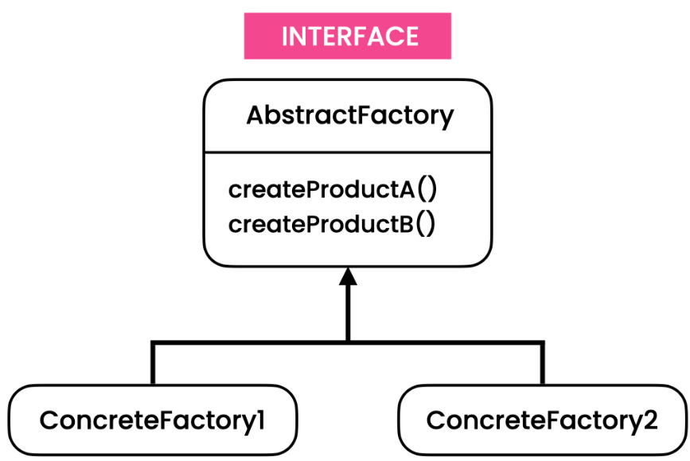

# Abstract Factory Pattern
[Refactoring Guru](https://refactoring.guru/design-patterns/abstract-factory),
[Digital Ocean](https://www.digitalocean.com/community/tutorials/abstract-factory-design-pattern-in-java),
[Java Spring Framework](https://springframework.guru/gang-of-four-design-patterns/abstract-factory-design-pattern/)

# Overview
The Abstract Factory pattern is a creational design pattern that provides an interface for creating families of related or dependent objects without specifying their concrete classes. It encapsulates the creation of objects and ensures that a client does not need to know which concrete classes are instantiated.

# Initial Problem
In object-oriented programming, it is common to have families of related objects that share common characteristics or behavior. However, creating these objects directly in client code can lead to tight coupling and dependencies on specific implementations. The Abstract Factory pattern addresses this problem by defining an abstract factory interface that declares methods for creating each type of object in a family. Concrete factories implement this interface and are responsible for creating specific variations of the objects. The client code uses the abstract factory interface to create the objects, without being aware of the concrete classes involved.

# When to Apply
The Abstract Factory pattern is useful in the following situations:

* When a system should be independent of how its products are created, composed, and represented.
* When a system should be configured with one of multiple families of products.
* When a family of related product objects needs to be used together and ensures their compatibility.
* When you want to provide a library of product objects, exposing only their abstract interfaces.

In general, the Abstract Factory pattern is beneficial when you need to create families of related objects and want to provide a level of abstraction between the client code and the concrete implementations. It promotes loose coupling, modularity, and flexibility in creating objects.

