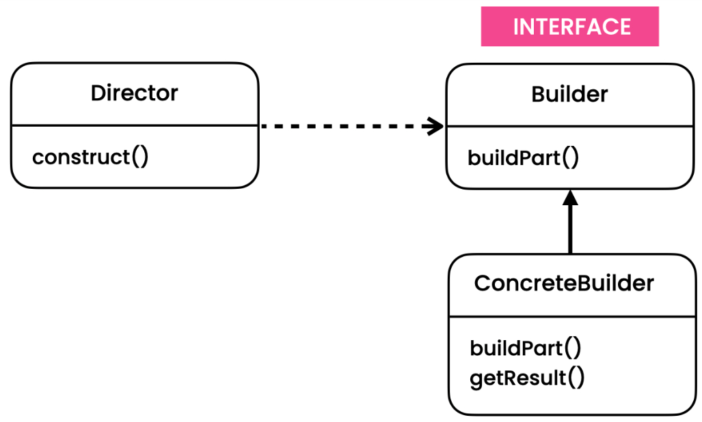

# Builder Pattern
[Refactoring Guru](https://refactoring.guru/design-patterns/builder),
[Digital Ocean](https://www.digitalocean.com/community/tutorials/builder-design-pattern-in-java),
[Java Spring Framework](https://springframework.guru/gang-of-four-design-patterns/builder-pattern/)

# Overview
The Builder pattern is a creational design pattern that allows the construction of complex objects step by step. It separates the construction of an object from its representation, allowing the same construction process to create different representations.

# Initial Problem
In some cases, the creation of an object requires a complex and step-by-step process. This process might involve setting multiple properties, validating inputs, or performing additional operations to ensure the consistency and correctness of the object being created. Directly instantiating the object or using a complex constructor can lead to code that is difficult to read, understand, and maintain. Additionally, the number of constructor parameters can become overwhelming.

The Builder pattern addresses these issues by providing a separate Builder class that encapsulates the construction process. The Builder class defines individual methods for each step of the construction, allowing clients to customize the object being built. Once the building process is complete, the Builder class returns the fully constructed object.

# When to Apply
The Builder pattern is useful in the following situations:

* When the construction of an object involves multiple steps or complex logic.
* When you want to create different representations of an object using the same construction process.
* When the number of constructor parameters is large or likely to change frequently.
* When you want to improve the readability and maintainability of the client code by providing a clear and expressive API for constructing objects.

Using the Builder pattern simplifies the object construction process, makes the code more readable, and allows for greater flexibility in creating different variations of an object.

