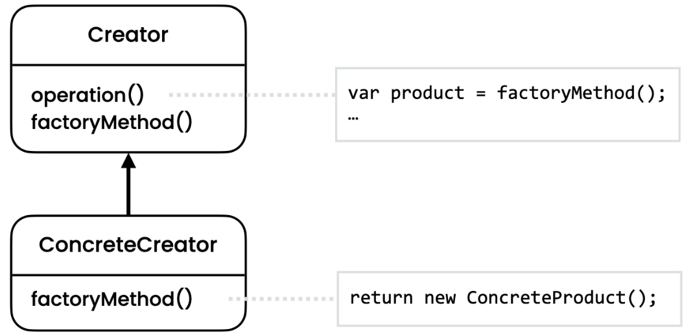

# Factory Method Pattern
[Refactoring Guru](https://refactoring.guru/design-patterns/factory-method),
[Digital Ocean](https://www.digitalocean.com/community/tutorials/factory-design-pattern-in-java),
[Java Spring Framework](https://springframework.guru/gang-of-four-design-patterns/factory-method-design-pattern/)

## Overview
The Factory Method pattern is a creational design pattern that provides an interface for creating objects, but allows subclasses to decide which class to instantiate. It promotes loose coupling by encapsulating object creation in a separate method or class.

## Initial Problem
In software development, there are scenarios where a class cannot anticipate the type of objects it needs to create in advance. For example, a framework might define a class that needs to create product objects, but the specific product implementation may vary depending on user preferences or configuration. In such cases, directly instantiating specific product classes in the framework can lead to tight coupling and inflexibility.

The Factory Method pattern solves this problem by introducing an abstract factory method in the creator class/interface, which subclasses can override to provide their own implementation of object creation. The creator class is decoupled from the concrete product classes, allowing for dynamic creation and flexibility.

## When to Apply
The Factory Method pattern is useful in the following situations:

* When a class cannot anticipate the type of objects it needs to create beforehand.
* When a class wants to delegate the responsibility of object creation to its subclasses.
* When a class wants to provide a hook for subclasses to extend or customize the object creation process.
* When a class wants to encapsulate object creation logic in a separate method or class.

By applying the Factory Method pattern, you can achieve code that is more maintainable, extensible, and adaptable to varying object creation requirements.

