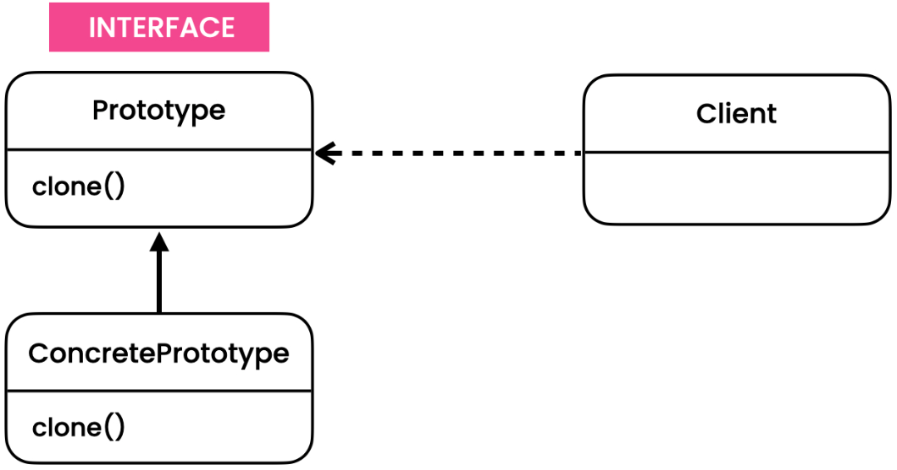

# Prototype Pattern
[Refactoring Guru](https://refactoring.guru/design-patterns/prototype),
[Digital Ocean](https://www.digitalocean.com/community/tutorials/prototype-design-pattern-in-java),
[Java Spring Framework](https://springframework.guru/gang-of-four-design-patterns/prototype-pattern/)

## Overview
The Prototype pattern is a creational design pattern that allows objects to be copied or cloned. It is used when creating an object is costly or complex, and the newly created object can be an instance of an existing object, called the prototype. This pattern promotes flexibility and reusability by providing a way to create new objects by cloning existing ones.

## Initial Problem
In software development, creating new objects can be resource-intensive or involve complex initialization steps. In such cases, creating objects from scratch can be inefficient and error-prone. The Prototype pattern addresses this issue by defining a prototype object that serves as a blueprint for creating new objects. Rather than creating objects from scratch, we can clone the existing prototype and customize it as needed, avoiding the costly or complex initialization process.

## When to Apply
The Prototype pattern is applicable in the following scenarios:

* When creating objects is resource-intensive or requires complex initialization.
* When you want to avoid subclassing to create variations of objects.
* When you need to hide the complexity of object creation from the client.
* When you want to create a large number of similar objects efficiently.

By using the Prototype pattern, you can improve performance, simplify object creation, and promote reusability. It is particularly useful when dealing with complex objects or when you need to create variations of objects without explicitly specifying their classes.

