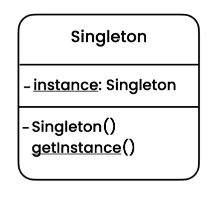

# Singleton Pattern
[Refactoring Guru](https://refactoring.guru/design-patterns/singleton), 
[Digital Ocean](https://www.digitalocean.com/community/tutorials/java-singleton-design-pattern-best-practices-examples), 
[Java Spring Framework](https://springframework.guru/gang-of-four-design-patterns/singleton-design-pattern/)

## Overview
The Singleton pattern is a creational design pattern that ensures a class has only one instance, and provides a global point of access to that instance. It is used when you want to restrict the instantiation of a class to a single object and ensure that there is a single instance of the class available throughout the application.

## Initial Problem
In certain situations, it is important to have only a single instance of a class. This can be due to various reasons such as controlling access to shared resources, managing a centralized state, or avoiding duplication of expensive object creation. The Singleton pattern addresses this problem by providing a way to enforce that only one instance of a class is created and providing a global point of access to that instance.

## When to Apply
The Singleton pattern is applicable in the following scenarios:

* When you need to ensure that a class has only a single instance available in the application.
* When you want to provide a global access point to that instance for other objects to use.
* When you need to control access to shared resources, such as a database connection pool or a file system.
* When you want to restrict object instantiation to save resources or ensure consistency.

It's important to note that the Singleton pattern should be used judiciously, as it can introduce tight coupling and limit flexibility in certain cases. Overuse of singletons can lead to code that is difficult to test and maintain. Consider other design patterns or alternatives if the Singleton pattern does not align with your specific requirements.

