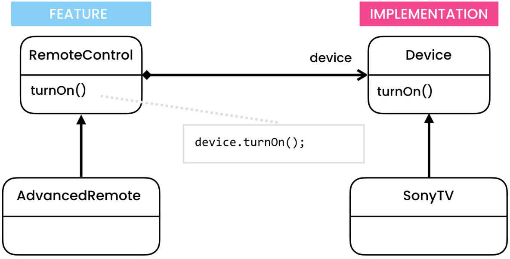

# Bridge Pattern
[Refactoring Guru](https://refactoring.guru/design-patterns/bridge), [Digital Ocean](https://www.digitalocean.com/community/tutorials/bridge-design-pattern-java), [Java Spring Framework](https://springframework.guru/gang-of-four-design-patterns/bridge-pattern/)

# Overview
The Bridge pattern is a structural design pattern that decouples an abstraction from its implementation, allowing them to vary independently. It provides a way to handle a complex hierarchy by splitting it into two separate class hierarchies: the abstraction hierarchy and the implementation hierarchy. The Bridge pattern promotes loose coupling between these two hierarchies, enabling changes in one hierarchy to have minimal impact on the other.

# Initial Problem
In traditional object-oriented design, a class hierarchy can become complex and hard to manage when it has multiple dimensions of variation. For example, consider a scenario where you have different types of shapes (e.g., circles, squares) and different rendering platforms (e.g., OpenGL, DirectX). Without the Bridge pattern, you would need to create a separate subclass for each combination of shape and rendering platform, resulting in an explosion of classes.

The Bridge pattern addresses this problem by decoupling the abstraction (shape) from its implementation (rendering platform) through composition instead of inheritance. By having separate class hierarchies for the abstraction and implementation, you can easily add new shapes or rendering platforms without modifying existing classes.

# When to Apply
You should consider using the Bridge pattern in the following situations:

* When you want to decouple an abstraction from its implementation so that they can vary independently.
* When you have a class hierarchy with multiple dimensions of variation and you want to avoid the exponential growth of subclasses.
* When changes in the implementation should not affect clients that use the abstraction.
* When you want to hide the implementation details from clients.

The Bridge pattern is particularly useful when you anticipate a need to extend or modify the abstraction and implementation hierarchies independently. It provides flexibility and extensibility to your codebase, making it easier to maintain and evolve over time.

