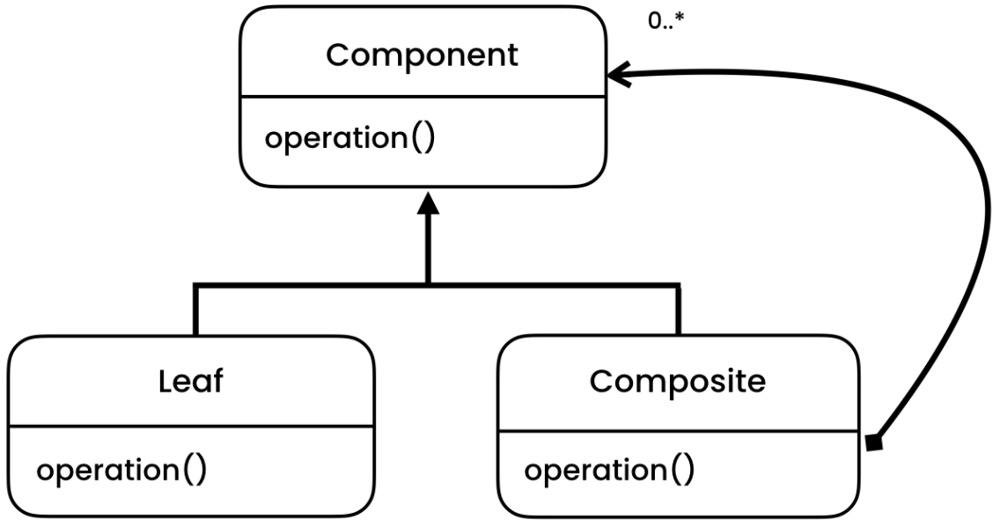

# Composite Pattern
[Refactoring Guru](https://refactoring.guru/design-patterns/composite), [Digital Ocean](https://www.digitalocean.com/community/tutorials/composite-design-pattern-in-java), [Java Spring Framework](https://springframework.guru/gang-of-four-design-patterns/composite-pattern/)

## Overview
The Composite pattern is a structural design pattern that allows you to compose objects into tree-like structures and work with them as if they were individual objects. It lets you represent part-whole hierarchies and treat individual objects and compositions uniformly.

## Initial Problem
In many applications, you often need to work with complex structures that consist of objects and their compositions. However, treating each object individually can lead to code duplication and lack of consistency when dealing with both individual objects and collections of objects. The Composite pattern addresses this problem by providing a unified way of interacting with objects and compositions.

The key idea behind the Composite pattern is to create an abstract base class or interface that represents both individual objects and compositions. This base class or interface defines common operations that can be performed on both types of entities. Each object and composition in the hierarchy derives from this base class or implements this interface, thereby ensuring a common interface for all elements in the structure.

## When to Apply
The Composite pattern is useful in the following situations:

* When you want to represent part-whole hierarchies of objects.
* When you want clients to be able to treat individual objects and compositions uniformly.
* When you want to allow clients to ignore the differences between compositions and individual objects, and work with them using a common interface.
* When you want to add or remove objects dynamically from a structure.

The Composite pattern is particularly valuable when you need to work with complex hierarchies of objects that may have varying levels of complexity themselves. It promotes code reusability, flexibility, and consistency in dealing with object compositions.

