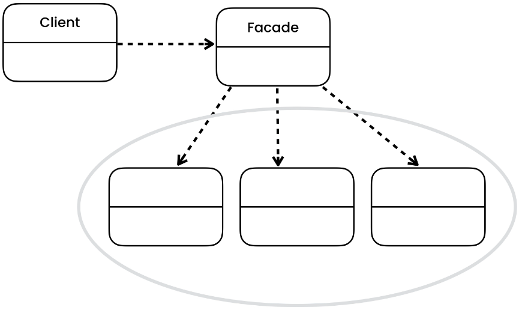

# Facade Pattern
[Refactoring Guru](https://refactoring.guru/design-patterns/facade), [Digital Ocean](https://www.digitalocean.com/community/tutorials/facade-design-pattern-in-java), [Java Spring Framework](https://springframework.guru/gang-of-four-design-patterns/facade-pattern/)

## Overview
The Facade pattern is a structural design pattern that provides a simplified interface to a complex subsystem of classes, making it easier to use and understand. It acts as a unified interface that hides the complexities of the subsystem and presents a simplified view to the client.

## Initial Problem
In software development, complex subsystems often consist of multiple classes with intricate relationships and dependencies. This can make it difficult for clients to understand and use the subsystem, as they would need to interact with numerous classes and manage their dependencies individually. The Facade pattern addresses this problem by providing a high-level interface or facade that encapsulates the complexities of the subsystem and provides a simplified interface for clients.

## When to Apply
The Facade pattern is useful in the following situations:

* When you want to provide a simple and unified interface to a complex subsystem.
* When you need to decouple the client code from the subsystem's implementation details.
* When you want to reduce dependencies and improve maintainability by encapsulating subsystem interactions.
* When you want to provide a higher-level abstraction that shields clients from the complexities of the subsystem.

The Facade pattern is particularly valuable when working with large and complex systems, legacy codebases, or when integrating multiple external libraries or APIs. It helps to promote good software design principles such as encapsulation, abstraction, and loose coupling.

