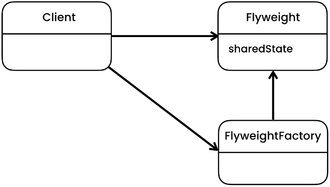

# Flyweight Pattern
[Refactoring Guru](https://refactoring.guru/design-patterns/flyweight), [Digital Ocean](https://www.digitalocean.com/community/tutorials/flyweight-design-pattern-java), [Java Spring Framework](https://springframework.guru/gang-of-four-design-patterns/flyweight-pattern/)

# Overview
The Flyweight pattern is a structural design pattern that aims to minimize memory usage and improve performance by sharing as much data as possible across multiple objects. It achieves this by splitting objects into two parts: intrinsic and extrinsic. The intrinsic state is shared among multiple objects, while the extrinsic state can vary and is stored externally.

# Initial Problem
In some applications, there might be a large number of similar objects that only differ in some of their properties. Creating and maintaining separate objects for each instance can lead to high memory consumption and reduced performance. The Flyweight pattern addresses this problem by separating the object's state into intrinsic and extrinsic parts. The intrinsic state is shared among multiple objects and can be stored in a flyweight factory, while the extrinsic state is kept separate and can be passed as a parameter when invoking operations on the flyweight objects.

# When to Apply
You can consider using the Flyweight pattern in the following situations:

* When you have a large number of objects with similar state, and memory usage is a concern.
* When the majority of the object's state can be made intrinsic (shared) and separated from the variable extrinsic (unique) state.
* When the application can benefit from caching and reusing existing objects instead of creating new ones.
* When the application can separate the state that can be shared from the state that needs to be unique.

It's important to note that the Flyweight pattern introduces additional complexity by separating the state of an object. Therefore, it should only be applied when the memory savings and performance improvements outweigh the added complexity.

