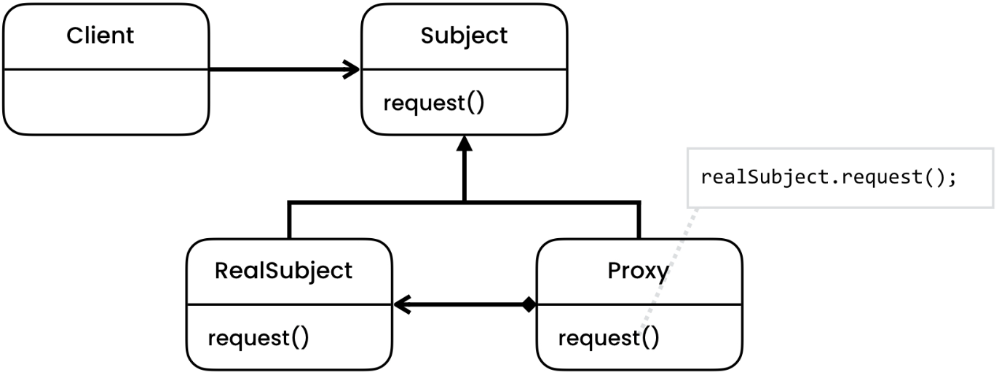

# Proxy Pattern
[Refactoring Guru](https://refactoring.guru/design-patterns/proxy), [Digital Ocean](https://www.digitalocean.com/community/tutorials/proxy-design-pattern), [Java Spring Framework](https://springframework.guru/gang-of-four-design-patterns/proxy-pattern/)

# Overview
The Proxy pattern is a structural design pattern that provides a surrogate or placeholder for another object to control access to it. It allows us to create a representative object that can act as an intermediary between the client and the real object, providing additional functionality or controlling access to the real object.

# Initial Problem
In some situations, direct access to an object may not be desirable or appropriate. This can occur when the object is resource-intensive to create, when it needs to be protected from unauthorized access, or when additional functionality needs to be added before or after accessing the object. The Proxy pattern addresses these concerns by introducing a proxy object that can control access to the real object.

# When to Apply
The Proxy pattern is useful in the following situations:

* When you want to provide a simplified or restricted interface to a complex or sensitive object.
* When you need to control access to an object, such as implementing access rights or authentication.
* When you want to delay the creation of an object until it is actually needed, which can improve performance.
* When you want to add additional functionality before or after accessing an object, such as caching results, logging, or monitoring.

In general, the Proxy pattern is useful in any situation where you need to introduce an intermediary between the client and the real object to provide additional functionality, control access, or delay object creation.

